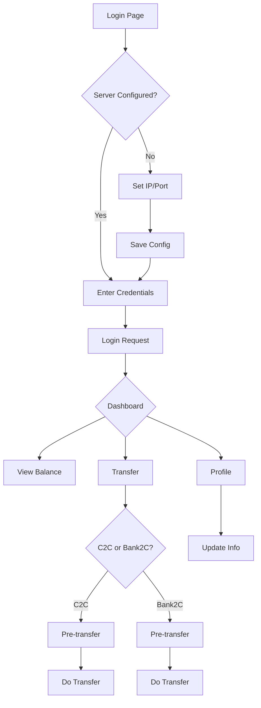

## 1. Product Overview
基于gozero API协议搭建的支付网关前端交易系统，提供用户注册、登录、转账、余额查询等核心功能。
- 目标用户：普通用户，通过手机号/邮箱注册使用
- 市场价值：提供便捷的C2C转账和银行卡充值功能，简化支付流程

## 2. Core Features

### 2.1 User Roles
| Role | Registration Method | Core Permissions |
|------|---------------------|------------------|
| Normal User | Phone/Email registration | Register, login, transfer, check balance |

### 2.2 Feature Module
1. **Login page**: Login with server config (IP/port), password input
2. **Dashboard**: User info display, balance overview, quick actions
3. **Transfer page**: C2C transfer, Bank2C transfer
4. **User Profile**: View and update user information

### 2.3 Page Details
| Page Name | Module Name | Feature description |
|-----------|-------------|---------------------|
| Login page | Server Config | Set backend API IP and port, persist config |
| Login page | Login Form | Password login with user_id |
| Dashboard | Balance Card | Display current balance and currency type |
| Dashboard | Quick Actions | Shortcuts to transfer and profile |
| Transfer page | C2C Transfer | Transfer between users with pre and do steps |
| Transfer page | Bank2C Transfer | Card to account transfer with pre and do steps |
| User Profile | View Info | Display detailed user information |
| User Profile | Update Info | Edit and save user profile |

## 3. Core Process

### Login Flow
1. User opens login page → Sets server IP/port → Clicks save
2. User enters user_id and password → Clicks login
3. System calls reg_user or verifies → Stores session → Redirects to dashboard

### C2C Transfer Flow
1. User enters buyer_user_id → Clicks pre-transfer
2. System returns transaction_id → User fills seller info and amount
3. User enters password → Clicks confirm transfer
4. System processes and returns result

### Bank2C Transfer Flow
1. User clicks Bank2C transfer → System returns transaction_id
2. User selects bank type, enters amount and description
3. System processes and returns result

## 4. User Interface Design

### 4.1 Design Style
- Primary color: Deep blue (#1e40af) - conveys trust and security
- Secondary color: Emerald green (#059669) - success/confirm actions
- Warning color: Amber (#d97706) - caution actions
- Danger color: Red (#dc2626) - cancel/delete actions
- Button style: Rounded corners (8px), gradient hover effects
- Font: Inter (sans-serif), clean and modern
- Layout: Card-based with subtle shadows, centered content
- Icon style: Line icons, consistent stroke width

### 4.2 Page Design Overview
| Page Name | Module Name | UI Elements |
|-----------|-------------|-------------|
| Login page | Server Config | Card with IP/port inputs, save button |
| Login page | Login Form | Card with user_id/password fields, login button |
| Dashboard | Balance Card | Large card with animated balance display |
| Dashboard | Quick Actions | Grid of action buttons with icons |
| Transfer page | C2C Transfer | Step-by-step form with progress indicator |
| Transfer page | Bank2C Transfer | Bank selection, amount input with validation |
| User Profile | View Info | Card layout with label-value pairs |
| User Profile | Update Info | Editable form fields with save button |

### 4.3 Responsiveness
- Desktop-first design
- Mobile-adaptive: Collapsible side menu, stacked cards
- Touch optimization: Larger tap targets (minimum 44px)

### 4.4 Visual Effects
- Smooth page transitions
- Form validation animations
- Balance card hover effects
- Transfer success/failure toast notifications