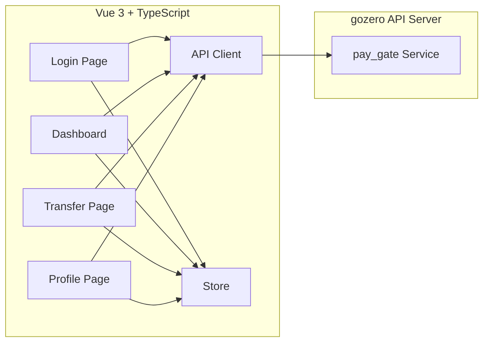

## 1. Architecture Design



## 2. Technology Description
- Frontend: Vue@3 + TypeScript + TailwindCSS@3 + Vite
- Initialization Tool: vite-init
- State Management: Pinia
- Routing: Vue Router
- HTTP Client: Axios
- Icons: Lucide Vue
- Backend: gozero API Server (external)

## 3. Route Definitions
| Route | Purpose |
|-------|---------|
| /login | Login page with server configuration |
| /dashboard | Main dashboard with balance and quick actions |
| /transfer | Transfer page (C2C and Bank2C) |
| /profile | User profile page (view and edit) |

## 4. API Definitions

### 4.1 Request/Response Types

```typescript
interface HealthReq {}
interface HealthRsp {}

interface UpdateUserInfoReq {
  user_id?: string
  name?: string
  gender?: number
  age?: number
  address?: string
  phone?: string
  email?: string
  id_type?: number
  id_card?: string
}

interface UpdateUserInfoRsp {
  user_id: string
}

interface RegUserReq {
  user_id?: string
  password?: string
  name?: string
  gender?: number
  age?: number
  address?: string
  phone?: string
  email?: string
  id_type?: number
  id_card?: string
}

interface RegUserRsp {
  user_id: string
}

interface GetUserInfoReq {
  user_id?: string
}

interface GetUserInfoRsp {
  user_id: string
  name: string
  gender: number
  age: number
  address: string
  phone: string
  email: string
  id_type: number
  id_card: string
}

interface GetUserBalanceInfoReq {
  user_id?: string
}

interface GetUserBalanceInfoRsp {
  user_id: string
  balance: number
  cur_type: number
}

interface C2CTransferPreReq {
  buyer_user_id: string
}

interface C2CTransferPreRsp {
  buyer_user_id: string
  transaction_id: string
}

interface C2CTransferDoReq {
  transaction_id: string
  buyer_user_id: string
  seller_user_id: string
  amount: number
  verify_type: number
  password: string
}

interface C2CTransferDoRsp {
  transaction_id: string
  buyer_user_id: string
  seller_user_id: string
  is_repeat: number
}

interface Bank2CPreReq {
  user_id: string
}

interface Bank2CPreRsp {
  user_id: string
  transaction_id: string
}

interface Bank2CDoReq {
  transaction_id: string
  user_id: string
  bank_type: number
  amount: number
  desc: string
}

interface Bank2CDoRsp {
  transaction_id: string
  user_id: string
  is_repeat: number
}
```

### 4.2 API Endpoints
| Method | Path | Handler |
|--------|------|---------|
| GET | /api/pay_gate/health | health |
| POST | /api/pay_gate/reg_user | reg_user |
| POST | /api/pay_gate/update_user_info | update_user_info |
| POST | /api/pay_gate/get_user_info | get_user_info |
| POST | /api/pay_gate/get_user_balance_info | get_user_balance_info |
| POST | /api/pay_gate/c2c_transfer_pre | c2c_transfer_pre |
| POST | /api/pay_gate/c2c_transfer_do | c2c_transfer_do |
| POST | /api/pay_gate/bank2c_pre | bank2c_pre |
| POST | /api/pay_gate/bank2c_do | bank2c_do |

## 5. Project Structure

```
src/
├── api/                    # API client definitions
│   └── pay_gate.ts         # pay_gate service API
├── components/             # Reusable components
│   ├── ServerConfig.vue    # Server configuration component
│   ├── BalanceCard.vue     # Balance display card
│   ├── TransferForm.vue    # Transfer form component
│   └── UserInfoCard.vue    # User info card
├── composables/            # Vue composables
│   ├── useAuth.ts          # Authentication logic
│   ├── useTransfer.ts      # Transfer logic
│   └── useUser.ts          # User info logic
├── stores/                 # Pinia stores
│   ├── auth.ts             # Auth state
│   └── config.ts           # Server config state
├── views/                  # Page views
│   ├── Login.vue           # Login page
│   ├── Dashboard.vue       # Dashboard page
│   ├── Transfer.vue        # Transfer page
│   └── Profile.vue         # Profile page
├── utils/                  # Utility functions
│   └── axios.ts            # Axios instance
├── App.vue                 # Root component
├── main.ts                 # Entry point
└── router/index.ts         # Router configuration
```

## 6. State Management

### 6.1 Auth Store
```typescript
interface AuthState {
  userId: string | null
  isLoggedIn: boolean
}
```

### 6.2 Config Store
```typescript
interface ConfigState {
  serverIp: string
  serverPort: string
  baseUrl: string
}
```

## 7. Server Configuration
- Default: localhost:8080
- Stored in localStorage for persistence
- Can be changed on login page